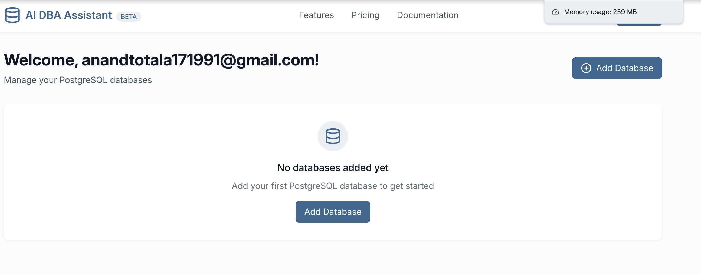
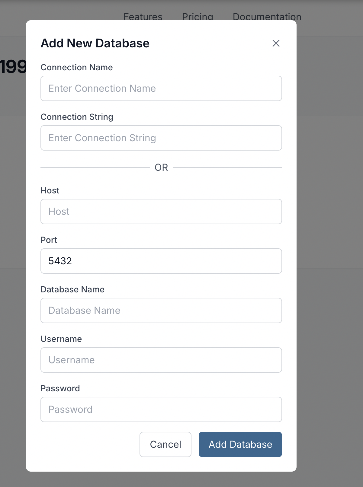
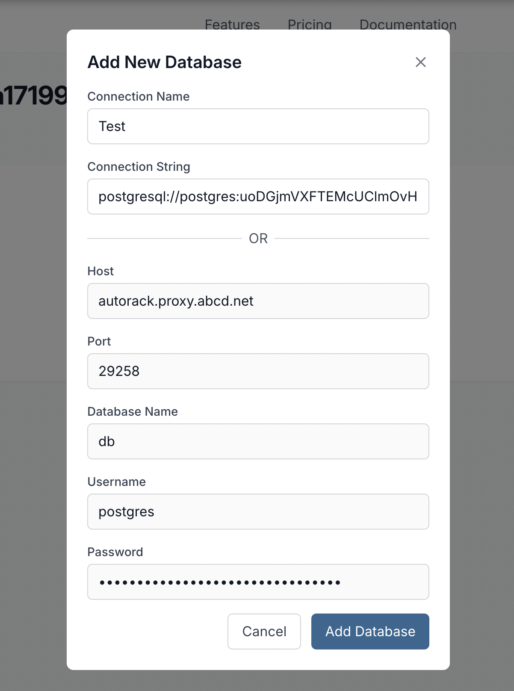
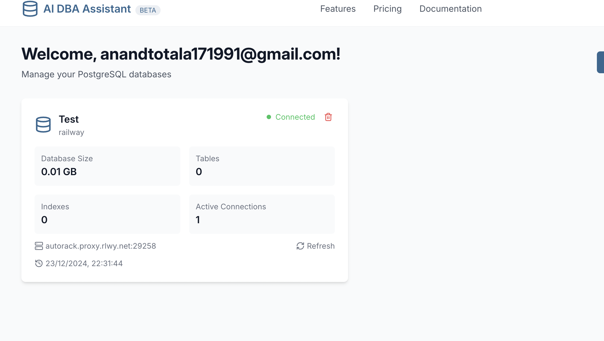
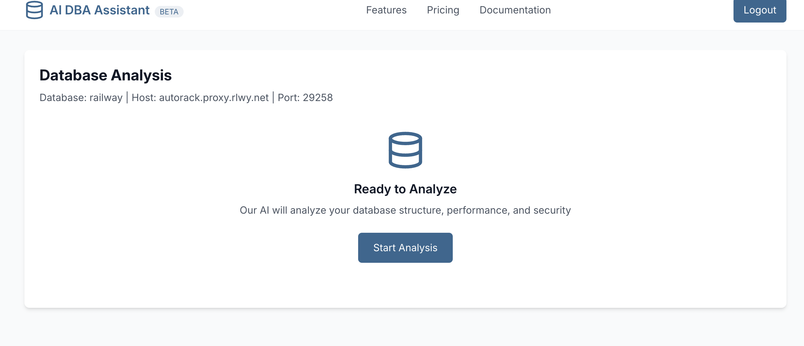
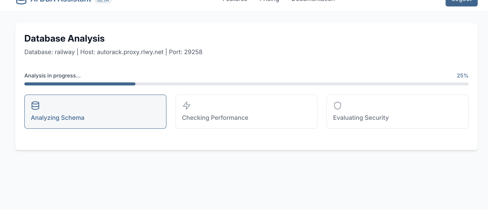
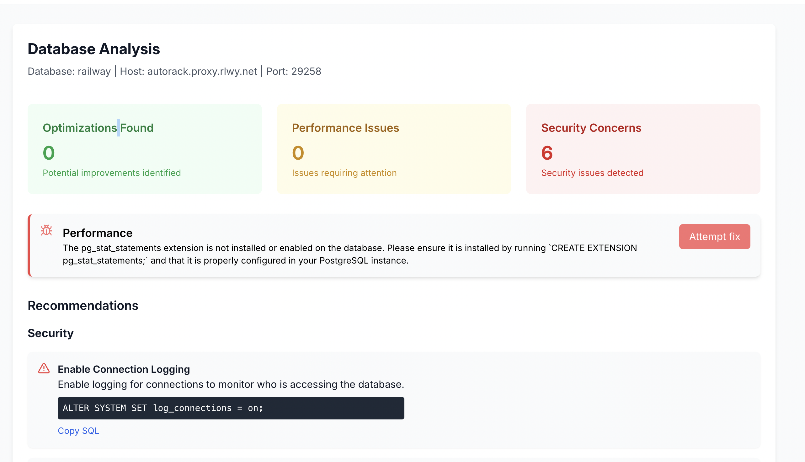

# Quick Start Guide

Welcome to your go-to platform for analyzing your PostgreSQL databases and getting actionable suggestions! Here's how you can get started:

## Dashboard

The dashboard is your starting point. View a summary of your connected databases, recent analyses, and quick access to features.

## Connect  Database

Step-by-Step:

1. Click the "Add Database" button.
 

2. Enter your database credentials (Connection string/ host, port, user, etc.).
 

3. Clock the "Add Database" button at the bottom of the pop up window to finish.

## Saved Databases

View and manage databases you've already connected. Easily select a database for re-analysis or delete unwanted connections.

## Start Analyzing

### **Prerequisites**:

Ensure your PostgreSQL database has the required extensions installed

- `pg_stat_statements`

### Ready to Analyze:

Once a database is connected, click on the desired database and you'll be redirected to the primary analysis screen.

### Start the  Analysis:

Click on the "Start Analysis" button to begin analyzing your database.

### In Progress:

Once the analysis begins, an intermediate screen will display the progress of your database being analyzed. You'll see a status indicator, completion percentage and a message to ensure the process is running smoothly.

### Analysis:

Dive into detailed results! The analysis screen provides insights, performance metrics, and suggestions tailored to your database.

## Insights

### Optimizations Found

This section provides recommendations to enhance your database’s performance, reduce resource consumption, and improve query execution times. Examples include:

- **Index Suggestions**: Identifies missing indexes that could significantly speed up your queries.
- **Unused Indexes**: Flags indexes that are not utilized and might be removed to save storage.

### Performance Issues

This section highlights bottlenecks and inefficiencies in your database operations. Examples include:

- **Slow Queries**: Lists queries with the highest execution times and provides insights into possible improvements.
- **Table Bloat**: Identifies tables with excessive fragmentation, affecting read and write efficiency.

### Security Concerns

Security is critical for database integrity. This section highlights potential vulnerabilities and best practices to secure your PostgreSQL database. Examples include:

- **Publicly Accessible Roles**: Flags roles with unnecessary or overly permissive access levels.
